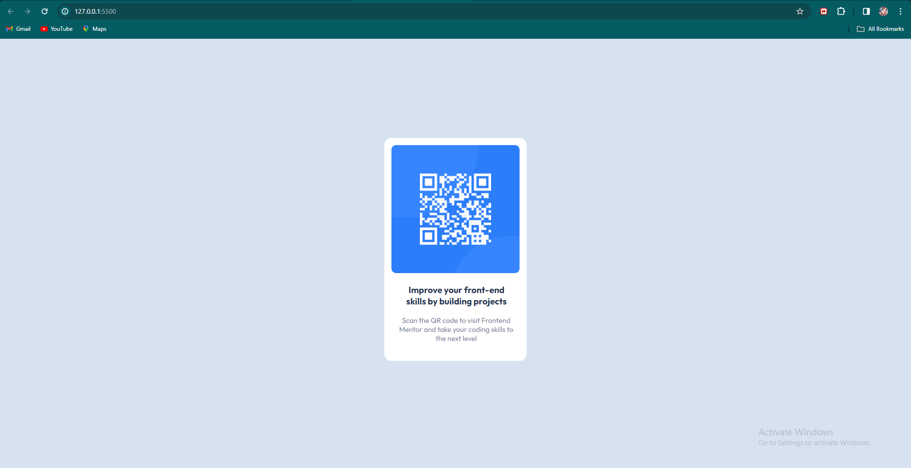

# Frontend Mentor - QR code component solution

This is a solution to the [QR code component challenge on Frontend Mentor](https://www.frontendmentor.io/challenges/qr-code-component-iux_sIO_H). Frontend Mentor challenges help you improve your coding skills by building realistic projects.

## Table of contents

- [Overview](#overview)
  - [Screenshot](#screenshot)
  - [Links](#links)
- [Useful resources](#useful-resources)
- [Author](#author)

## Overview

### Screenshot

### Links

- Solution URL: [Solution](https://pradeeps033.github.io/Web-Projects/)
- Live Site URL: [LiveSite](https://pradeeps033.github.io/Web-Projects/)

## Useful resources

- [w3schools](https://www.w3schools.com/)

## Author

- Frontend Mentor - [@pradeeps033](https://www.frontendmentor.io/profile/pradeeps033)
